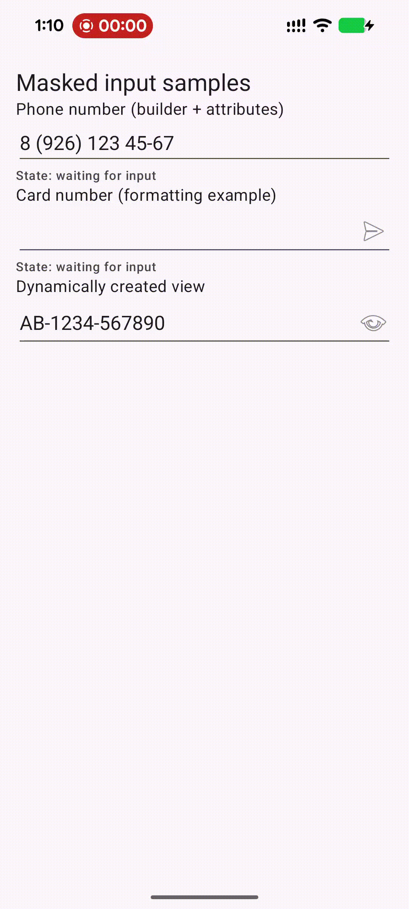

# Masked-EditText

[](https://central.sonatype.com/artifact/io.github.pinball83/masked-edittext/overview)

Modern, Kotlin-first input masking for Android with both classic Views and Jetpack Compose APIs. This refactor keeps the original `MaskedEditText` API compatible while adding a shared mask core, a state machine for predictable behavior, and a composable `MaskedTextField`.

- Kotlin implementation with Java interop preserved
- View widget: `MaskedEditText` (backward compatible)
- Compose: `MaskedTextField` + `MaskedOptions` + reusable state holder
- Cursor policy + state machine for reliable caret movement and validation
- Tests: Robolectric + Compose

Demo apps: `demo_app` (Views) and `demo_app_compose` (Compose).



## Requirements

- Android `minSdk 21`
- Java/Kotlin toolchain compatible with Java 17
- Jetpack Compose is optional (only needed for the Compose API)

## Installation

This repository ships as a Gradle module. Choose one:

### Maven Central (recommended)

```gradle
repositories {
    mavenCentral()
}

dependencies {
    implementation("io.github.pinball83:masked-edittext:2.0.0")
}
```

Replace `2.0.0` with the latest published version.

### Project dependency (recommended when working in this repo)

- In `settings.gradle`: `include(":masked-edittext")`
- In your app module:

```gradle
dependencies {
    implementation(project(":masked-edittext"))
}
```

### Local Maven snapshot (integration testing)

- Publish: `./gradlew :masked-edittext:publishToMavenLocal`
- In your consuming project: add `mavenLocal()` to `repositories`
- Use the published coordinates printed by Gradle for the snapshot

Note: Older READMEs may refer to legacy coordinates from the original library; use the coordinates above for this Kotlin-first refactor.

## Usage

### Views (`MaskedEditText`)

XML:

```xml
<com.github.pinball83.maskededittext.MaskedEditText
    android:id="@+id/masked_edit_text"
    android:layout_width="match_parent"
    android:layout_height="wrap_content"
    android:inputType="number"
    app:mask="8 (***) *** **-**"
    app:notMaskedSymbol="*"
    app:format="[1][2][3] [4][5][6]-[7][8]-[10][9]"
    app:maskIcon="@drawable/ic_clear"
    app:required="false"/>
```

Kotlin:

```kotlin
val maskedEditText = MaskedEditText.Builder(context)
    .mask("8 (***) *** **-**")
    .notMaskedSymbol("*")
    .format("[1][2][3] [4][5][6]-[7][8]-[10][9]")
    .icon(R.drawable.ic_clear)
    .iconCallback { unmasked -> /* handle click */ }
    .stateChangeListener { old, new, event -> /* observe state */ }
    .build()

maskedEditText.setMaskedText("5551235567")
val unmasked = maskedEditText.getUnmaskedText()   // 5551235567
val formatted = maskedEditText.getFormattedText() // respects app:format when set
```

Supported attributes: `mask`, `notMaskedSymbol`, `format`, `maskIcon`, `required`.

Deprecated/no-op attributes kept for XML compatibility: `replacementChar`, `deleteChar`, `maskIconColor`.

### Jetpack Compose (`MaskedTextField`)

Idiomatic API with grouped options and a reusable state holder:

```kotlin
@Composable
fun PhoneField() {
    var phone by remember { mutableStateOf("") }

    MaskedTextField(
        value = phone,
        onValueChange = { phone = it },
        maskedOptions = MaskedOptions.phone(),
        inputOptions = MaskedInputOptions(
            keyboardOptions = KeyboardOptions(keyboardType = KeyboardType.Phone)
        ),
        label = { Text("Phone") }
    )
}
```

Advanced: control state and react to transitions:

```kotlin
@Composable
fun Advanced() {
    val options = MaskedOptions.custom(
        mask = "Q***************",
        format = "[1][2][3] [4][5][6]-[7][8]-[10][9]",
        onStateChanged = { old, new, event -> /* observe */ }
    )
    val state = rememberMaskedTextFieldState(initialValue = "", maskedOptions = options)

    OutlinedTextField(
        value = state.textFieldValue,
        onValueChange = { state.updateValue(it) },
        label = { Text("Custom") }
    )

    // Values
    val unmasked = state.unmaskedValue
    val formatted = state.getFormattedValue()
}
```

## Masks and Formats

Common masks:
- Phone: `8 (***) *** **-**`
- Credit card: `**** **** **** ****`
- SSN: `***-**-****`
- Date: `**/**/**` (MM/DD/YY)
- Time: `**:**` (HH:MM)

Use `format` to reorder captured digits in the returned formatted string, e.g. `"[1][2][3] [4][5][6]-[7][8]-[10][9]"`.

## State Machine

Both View and Compose APIs use the same state machine internally. You can observe transitions in Views via `setStateChangeListener(...)` and in Compose via `MaskedOptions(onStateChanged = ...)`.

Key states: `EMPTY`, `PARTIAL`, `COMPLETE`, `INVALID`. Key events: typing, deletion, paste, focus changes, programmatic set, validate.

Docs:
- `docs/API_REFACTORING_GUIDE.md`
- `docs/MODERNIZATION.md`
- `docs/MODERNIZATION_SUMMARY.md`

## Demo Apps

- Views sample: `demo_app`
- Compose sample: `demo_app_compose`

## Development

- Build AAR: `./gradlew assembleRelease`
- Publish local snapshot: `./gradlew :masked-edittext:publishToMavenLocal`
- Unit tests (Robolectric + Compose): `./gradlew test`
- Instrumentation/Compose UI tests: `./gradlew connectedAndroidTest`
- Lint: `./gradlew lint`

## Release (Maintainers)

See `docs/MAINTAINERS.md` for publishing/signing instructions.

## Migration from 1.x

- Library is now Kotlin-first; Java interop preserved
- New Compose API (`MaskedTextField`, `MaskedOptions`, state holder)
- `replacementChar`, `deleteChar`, and `maskIconColor` are deprecated/no-op
- Prefer `getFormattedText()` / `state.getFormattedValue()` when using custom `format`
- Cursor handling is policy-driven and more predictable

For a deep dive, see `docs/MODERNIZATION_SUMMARY.md` and `docs/MODERNIZATION.md`.

## License

This project retains the original library’s license; see `LICENSE`.
